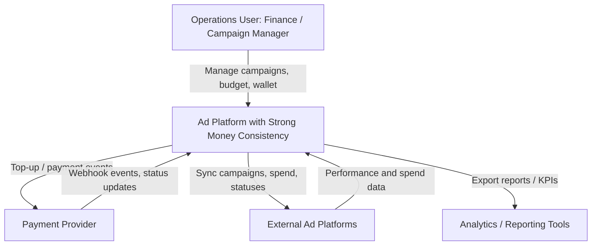
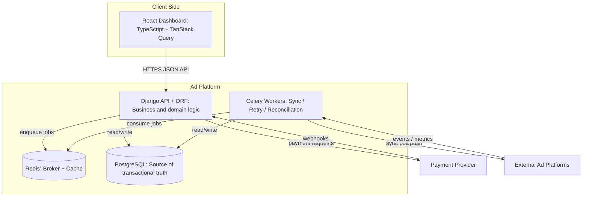
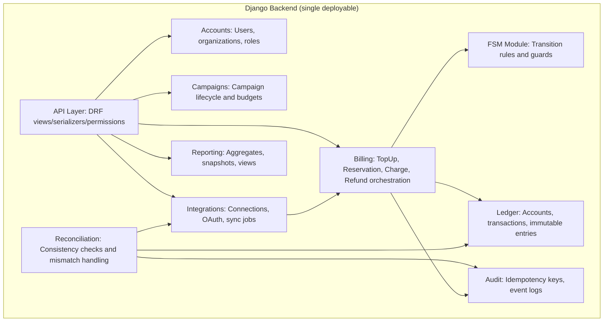

# C4 Architecture Diagram

This document describes the project using C4 levels:

- Level 1: System Context
- Level 2: Containers
- Level 3: Key Components (Backend focus)

---

## C4 Level 1 - System Context

---

## C4 Level 2 - Container Diagram

---

## C4 Level 3 - Component Diagram (Django Backend)

---

## Notes

- `Billing` orchestrates money operations but does not replace ledger invariants.
- `Ledger` is the financial source of truth (double-entry + immutability).
- `FSM` guards process transitions and keeps workflow logic explicit.
- `Reconciliation` verifies internal records against external systems and raises discrepancies.
